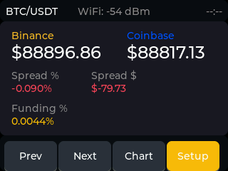

# ESP32-2432S028 Crypto Mini-Dashboard

A real-time cryptocurrency price monitoring dashboard for the ESP32-2432S028 (Cheap Yellow Display) development board. Displays Binance and Coinbase spot prices with spread analysis and funding rate tracking.


Dashboard:



*Live screenshot captured via serial command showing BTC/ETH/SOL prices with funding rates*

## Hardware

- **Board**: ESP32-2432S028 (CYD - Cheap Yellow Display)
- **Display**: 2.8" ILI9341 TFT (320x240)
- **Touch**: XPT2046 resistive touchscreen
- **Connectivity**: Wi-Fi (ESP32 built-in)

## Features

- Real-time price tracking from Binance and Coinbase
- Spread calculation (absolute and percentage)
- Funding rate monitoring (Binance perpetual futures)
- Multi-symbol support (BTC, ETH, SOL)
- Touch navigation between symbols and screens
- Configurable alert thresholds
- Persistent settings (NVS storage)
- **Web dashboard** - Remote monitoring and configuration via browser
- **OTA firmware updates** - Update firmware via web browser (HTTP)
- **Screenshot capture (optional)** - Capture UI via serial commands (disabled by default)
- **Compile-time feature flags** - Disable unused features to save flash space

### Web Dashboard

Monitor prices and configure settings remotely from any device on your network:

1. Ensure device is connected to WiFi
2. Find device IP address on the Dashboard or Settings screen
3. Open browser and navigate to `http://<ESP32-IP>:8080/dashboard`

**Features:**
- **Real-time monitoring** - Live BTC/ETH prices, spreads, and funding rates (auto-refresh every 5s)
- **Settings configuration** - Adjust alert thresholds and refresh intervals
- **Responsive design** - Works on desktop, tablet, and mobile
- **Binance color scheme** - Matches physical dashboard aesthetics

**REST API:**
- `GET /api/prices` - Current prices and funding rates for all symbols
- `GET /api/settings` - Current configuration
- `POST /api/settings` - Update configuration
- `POST /api/settings/reset` - Reset to factory defaults

**Flash impact:** +18KB (79.8% → 81.2%)

### Feature Flags

Optional features can be disabled at compile-time to free up flash memory. Edit `src/config.h`:

```cpp
#define ENABLE_OTA 1         // OTA updates (saves ~68KB when disabled)
#define ENABLE_SERIAL 1      // Debug output (saves ~6KB when disabled)  
#define ENABLE_SCREENSHOT 1  // Screenshots (saves ~1KB when disabled)
```

**Flash savings** (measured):
- Default build (HTTP + Web): **81.2% flash** (1,064,881 bytes) - 246KB available
- With HTTPS enabled: **~95% flash** (~1,245,000 bytes) - 65KB available  
- Minimal (all disabled): **~72% flash** (~945,000 bytes) - 366KB available
- **HTTPS costs 131KB** - disabled by default to maximize available space
- **Web dashboard costs 18KB** - included by default for remote monitoring

See [docs/FEATURE_FLAGS.md](docs/FEATURE_FLAGS.md) for complete configuration guide.

### OTA Updates

Update firmware without USB cable via web browser:

1. Connect to device's WiFi network
2. Navigate to **Settings** screen on device and tap **OTA** button to see upload URL: `http://<IP>:8080`
3. Open URL in browser, select `.bin` file, click "Upload Firmware"
4. Device automatically reboots with new firmware

**Note:** OTA requires `ENABLE_OTA 1` in `src/config.h` (enabled by default). You can also access the dashboard at `http://<IP>:8080/dashboard` for monitoring and configuration.

## Screenshots

The dashboard supports software screenshots via serial commands. Capture the current UI state and download it to your computer:

```bash
# Take screenshot and download in one command
python3 download_screenshot.py -s
```

**Serial Commands:**
- `SCREENSHOT` - Capture current display to SPIFFS
- `DOWNLOAD` - Download screenshot via hex-encoded serial transfer
- `LIST` - Show files on SPIFFS

The screenshot feature captures the full 320×240 display in 24-bit BMP format (~230 KB). The capture process:
1. Pauses network tasks to prevent interference
2. Captures screen in 6 passes of 40 rows each (works within available heap)
3. Intercepts LVGL's display flush callback for pixel data
4. Converts RGB565 → RGB888 and writes BMP format
5. Downloads via serial using hex encoding for reliability

See [docs/SCREENSHOT.md](docs/SCREENSHOT.md) for complete documentation.

## Configuration

### Wi-Fi Credentials

Create or edit `src/secrets.h` with your Wi-Fi credentials:

```cpp
#ifndef SECRETS_H
#define SECRETS_H

// Wi-Fi credentials - KEEP THIS FILE GITIGNORED!
#define WIFI_SSID "YourWiFiNetworkName"
#define WIFI_PASS "YourWiFiPassword"

#endif // SECRETS_H
```

**Important:** Add `src/secrets.h` to your `.gitignore` to avoid committing credentials:

```bash
echo "src/secrets.h" >> .gitignore
```

### Settings

Default configuration can be modified in `src/app/app_config.cpp`:

- **Price Refresh**: 5 seconds (5000ms)
- **Funding Refresh**: 60 seconds (60000ms)
- **Spread Alert**: 0.5% threshold
- **Funding Alert**: 0.01% threshold
- **Stale Data**: 15 seconds timeout

Settings can also be adjusted via the Settings screen on the device (persists across reboots).

## Build & Flash

Using PlatformIO:

```bash
# Build
pio run

# Upload to device
pio run -t upload --upload-port /dev/cu.usbserial-XXXXX

# Monitor serial output
pio device monitor --baud 115200
```

## Project Structure

```
/src
  main.cpp
  secrets.h          # Wi-Fi credentials (gitignored)
  config.h           # Feature flags (OTA, Serial, Screenshot)
  app/               # Application logic
    app_model.h/.cpp       # Thread-safe state management
    app_config.h/.cpp      # Configuration defaults
    app_math.h/.cpp        # Spread calculations
    app_scheduler.h/.cpp   # FreeRTOS task management
  net/               # Networking layer
    net_wifi.h/.cpp        # Wi-Fi connection management
    net_http.h/.cpp        # HTTP client wrapper
    net_binance.h/.cpp     # Binance API adapter
    net_coinbase.h/.cpp    # Coinbase API adapter
    net_time.h/.cpp        # NTP time sync
    net_ota.h/.cpp         # OTA firmware update server
  ui/                # User interface
    ui_root.h/.cpp         # UI initialization
    ui_screens.h/.cpp      # Screen layouts
    ui_bindings.h/.cpp     # Model-to-UI data binding
    ui_styles.h/.cpp       # UI styling
    ui_screenshot.h/.cpp   # Screenshot capture (SPIFFS)
  hw/                # Hardware abstraction
    hw_display.h/.cpp      # Display driver (LVGL)
    hw_touch.h/.cpp        # Touch input (XPT2046)
    hw_alert.h/.cpp        # Alert/buzzer output
    hw_storage.h/.cpp      # NVS persistence
  tools/             # Development tools
    spiffs_download.cpp    # Serial screenshot download
```

Capture the current UI state via serial commands:

```bash
# Take screenshot and download
python3 download_screenshot.py -s
```

Or manually via serial monitor:
```
SCREENSHOT     # Capture display
LIST           # Verify file exists
DOWNLOAD       # Transfer file (use Python script to decode)
```

**What's captured:**
- Exact 320×240 pixel representation of LVGL display
- All UI elements: price cards, funding rates, spreads, status indicators
- Current symbol, WiFi signal, timestamps
- 24-bit BMP format (230,454 bytes)

**Use cases:**
- Document UI changes during development
- Capture bugs or visual issues for debugging
- Create documentation screenshots
- Monitor display state remotely

See [docs/SCREENSHOT.md](docs/SCREENSHOT.md) for technical detail
- **Funding**: Current funding rate (Binance perpetual)

### Alerts

Visual and audio alerts trigger when:
- Spread exceeds configured threshold (default 0.5%)
- Funding rate exceeds configured threshold (default 0.01%)
- Cooldown period prevents alert spam (30 seconds per symbol)

### Screenshots

Take screenshots of the current UI programmatically:

```cpp
#include "ui/ui_screenshot.h"

// Call from anywhere after ui_screenshot_init()
if (ui_take_screenshot("/dashboard.bmp")) {
    Serial.println("Screenshot saved!");
}
```

See [docs/SCREENSHOT.md](docs/SCREENSHOT.md) for detailed documentation and [docs/screenshot_examples.cpp](docs/screenshot_examples.cpp) for usage examples.

## Development

This project follows a modular architecture with clear separation:

- **No networking in UI modules** - UI only reads from model snapshots
- **No LVGL in networking modules** - Network tasks update model via thread-safe APIs
- **FreeRTOS tasks** - Networking runs in dedicated task, UI loop remains responsive
- **Mutex-protected state** - All model access is thread-safe via `model_snapshot()`
- **Compile-time feature flags** - Disable OTA/Serial/Screenshot to save ~75KB flash

### Documentation

- [FEATURE_FLAGS.md](docs/FEATURE_FLAGS.md) - Feature flag configuration guide
- [SCREENSHOT.md](docs/SCREENSHOT.md) - Screenshot capture documentation
- [BOARD.md](docs/BOARD.md) - Hardware pinout and specifications

See `COPILOT_TASKS.md` for detailed implementation roadmap and `ISSUES.md` for optimization notes.

## License

See LICENSE file for details.
